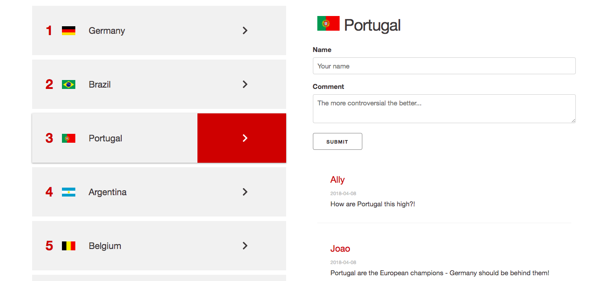

# FIFA Rankings Debate
.\
.
### Idea

FIFA Rankings are rarely that accurate... which is annoying because some people have been known to treat them like a league table. I feel this a little more acutely right now as (at the time of writing) England are in their lowest position for quite a few years. But I promise they're never any good!

This web app is a space for lovers of the world's most popular sport to discover the latest international rankings and debate their inaccuracies.\
.\
.
### Using the app

From the landing view, the user is prompted to click to load the latest rankings.\
.\
.
\
.\
.\
The page then reloads with the latest FIFA rankings. How it gets these rankings is described in Technologies and Code.\
.\
.
\
.\
.\
Clicking a team brings up the user-generated comments for that team. It also brings up a submit button so the user can submit their own contribution to the discussion.\
.\
.
\
.\
.
### Technologies and Code

The stack for this app is the usual suspects on the front end (HTML, CSS, Javascript, jQuery) and Node, Express, and MongoDB on the back end. So basically the MERN stack without React.

The rankings data is scraped from the FIFA website using markup parser Cheerio. This ensures that whenever the user loads the rankings, they're up-to-date.

Once scraped, the teams are stored in a MongoDB database (with the help of Mongoose), with teams and user comments as associated collections. As the app currently works, the team's Mongoose-generated id is used to tie thecomments. This is an obvious limitation as the clearing of the database on the load of the new rankings assigns the teams new ids, meaning that the comments will no longer be associated with them. This is to be fixed soon!

The validation is all done on the front end. The user's unable to submit a comment without first clicking on a team as there's no submit button until a team's clicked. Also, the user's not able to sumbit an empty name or comment field.\
.\
.
### UI / UX

As I often do, I used my beloved CSS framework Skeleton. This was perfect for the app as I just need a grid and some handsome buttons. Any framework would have probably been fine for this really. But I love using Skeleton.

I kept the color scheme simple in order to give prominence to the flags of the countries themselves, even though their quite small. They're the heartbeat of the content so I thought this was right. Virtually all of the design is in varying shades of grey, with elements that need emphasizing in red (primary title, ranking numbers, names on comments).

As always I kept it relatively simple. I used the CSS framework Skeleton, which is one of my favorites. I love how slim it is, allowing me to manipulate exactly what I want to very easily. And the grid, with its built-in padding, is very comfortable to work with.

The app is fully mobile responsive. Although there is one UX problem in mobile: the list of teams appears above the user comments on mobile, which means that a user has to scroll down to view the comments each time a new team is selected. The fix should be relatively easy so I'll do that soon.\
.\
.
